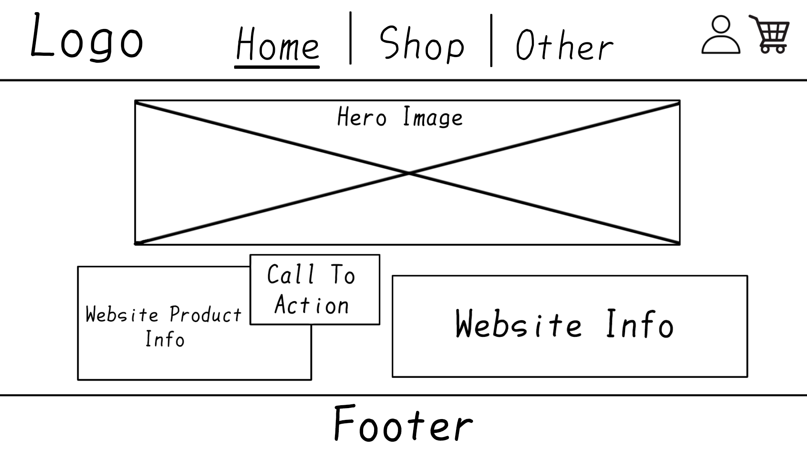
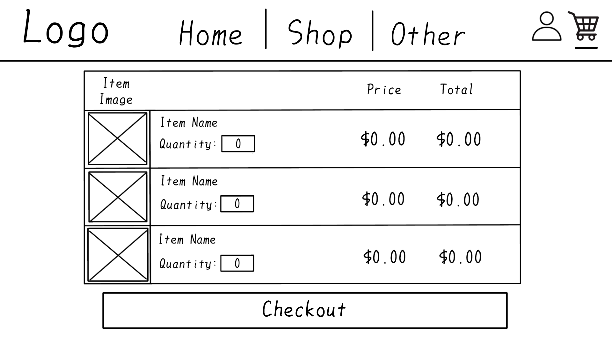
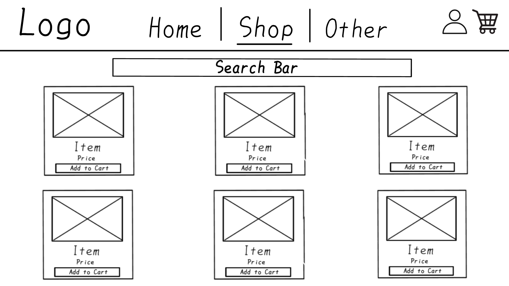
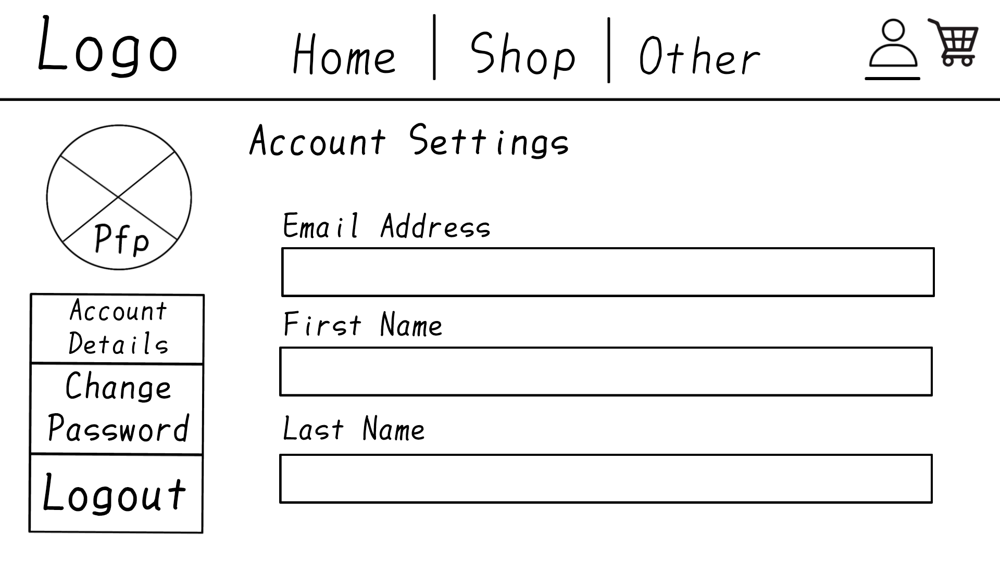

# GroceryApp

A simple Grocery App: Design Guide and UI Documentation.

## Overview
GroceryApp is a grocery shopping application designed to provide a clean and intuitive user experience.  
Users can browse products, add items to the cart, and complete their purchase.  
Admins can manage inventory and view orders.

## User Guide
1. **Sign Up / Login:** Create an account or login to access the app.  
2. **Browse Products:** Navigate the shop to view available groceries.  
3. **Add to Cart:** Click "Add" on items you want to purchase.  
4. **View Cart:** Review items in your cart and update quantities if needed.  
5. **Checkout:** Enter shipping information and complete payment.  
6. **Profile:** View past orders and account details.

## Admin Guide
1. **Login as Admin:** Use admin credentials to access the admin panel.  
2. **Manage Products:** Add, update, or delete grocery items.  
3. **View Orders:** See all user orders and their statuses.  
4. **Manage Users:** Optionally view and manage user accounts.  
5. **Dashboard:** Monitor app activity and inventory levels.

**This is a first idea, that will update with the project's update**

Grocery App: Design Guide
Color Palette
Role Color Hex Usage
Primary Green #4CAF50 Buttons, highlights, active elements
Secondary Orange #FF9800 Accents, secondary buttons, icons
Background Cream #FFF9F2 App background, cards background
Card Light Gray #F5F5F5 Cards, input backgrounds
Text Primary Dark Charcoal #212121 Main text, headings
Text Secondary Medium Gray #757575 Subtext, labels, secondary info
Success Bright Green #2E7D32 Success messages, confirmations
Error Red #D32F2F Error messages, validation errors
Warning Amber #FFA000 Warnings, alerts
Info Blue #0288D1 Info messages, hints

Typography
Role Font Family Weight Size (desktop) Size (mobile) Usage
Headings Montserrat Bold (700) 32px 24px Page titles, section headers
Subheadings Montserrat Semi-Bold (600) 24px 20px Card titles, smaller headings
Body Roboto Regular (400) 16px 14px General text, product descriptions
Buttons Montserrat Medium (500) 16px 14px Buttons, links
Labels / Input Text Roboto Regular (400) 14px 12px Form labels, small text

UI Styles
Buttons
• Primary: background-color: #4CAF50; color: #FFF; border-radius: 8px; padding: 10px 20px;
• Secondary: background-color: #FF9800; color: #FFF; border-radius: 8px; padding: 10px 20px;
• Hover: Slightly darker shade #43A047 for primary, #FB8C00 for secondary

Forms
• Background: #F5F5F5
• Border: 1px solid #DDD
• Focus: border-color: #4CAF50; box-shadow: 0 0 5px rgba(76, 175, 80, 0.5);
• Border-radius: 6px
• Padding: 8px

Cards
• Background: #FFF9F2
• Shadow: 0 2px 6px rgba(0,0,0,0.1)
• Border-radius: 10px
• Padding: 15px
• Margin-bottom: 20px

Alerts / Messages
• Success: background-color: #C8E6C9; color: #2E7D32;
• Error: background-color: #FFCDD2; color: #D32F2F;
• Info: background-color: #B3E5FC; color: #0288D1;
• Warning: background-color: #FFE0B2; color: #FFA000;

Navigation
• Background: Primary color: #4CAF50 with white text.
• Active link: Slightly darker green: #43A047

Suggest line hights of 1.5

