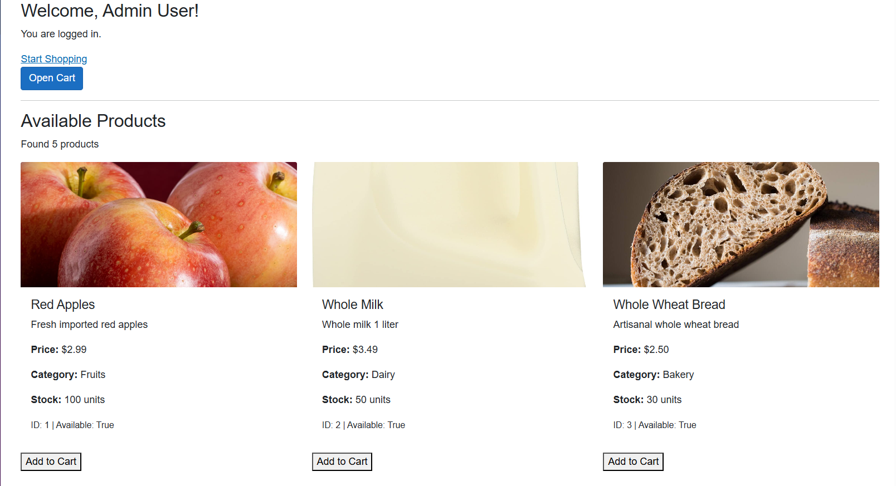
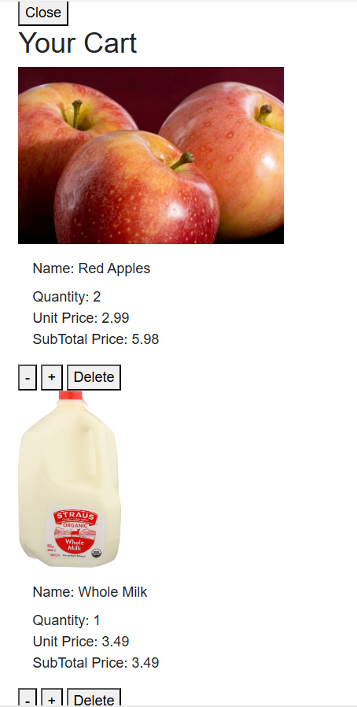
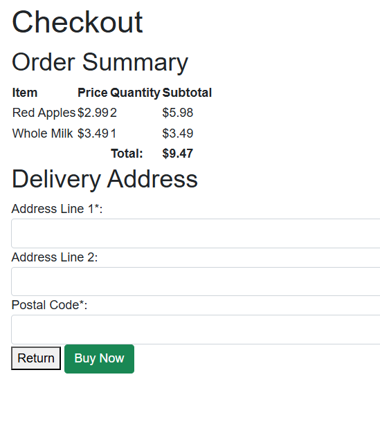
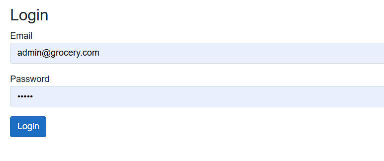
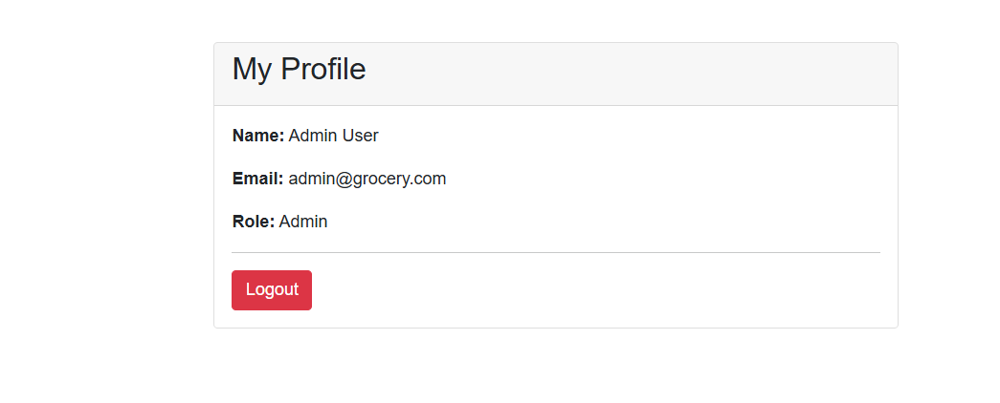

# 🛒 GroceryApp

Welcome to the GroceryApp! This is a web application built to help users browse and "buy" groceries online. It is designed to demonstrate **C#**, **Blazor**, and **Entity Framework Core** skills.

## 🚀 Live Demo

The application is deployed and running on Azure! You can try it out here:

👉 **[Live App on Azure](https://grocery-app.azurewebsites.net)**

*(Note: Admin features can be accessed at `/admin/grocery-items` if you are logged in as an admin).*

---

## 📖 Overview

I built this application to understand how to create a full-stack web app using .NET. It simulates a grocery store where you can:
*   View products.
*   Add them to a shopping cart.
*   "Checkout" (simulate a purchase).
*   Log in to see your profile.

It uses a **SQLite** database to save users and products, so the data stays there even if you restart the app.

---

## ✨ Features

### For Users
*   **Browse Products:** See a list of all available groceries with prices.
*   **Shopping Cart:** Add items, change quantities, or remove items. The cart updates automatically!
*   **Simulation Checkout:** Enter your address to "place" an order (it clears your cart and confirms the order).
*   **User Accounts:** Log in to access the app.

### For Admins
*   **Manage Products:** capable of Creating, Reading, Updating, and Deleting (CRUD) grocery items.
*   **Secure Access:** Only users with the 'Admin' role can access the admin pages.

---

## Technology Stack

Framework: .NET 8.0 (Blazor / ASP.NET Core)

Language: C#

Database: SQLite

ORM: Entity Framework Core

Frontend: Razor Components + Bootstrap

Platform: Windows (Local Development), Azure App Service (Cloud Deployment)

---

## Project Structure

The project follows a clean, component-based structure:

Components/ – Razor components, layouts, and pages

Components/Pages/Auth/ – Authentication pages (Login, Profile)

Models/ – Domain models (User, GroceryItem, ShoppingCart, CartItem)

Data/ – EF Core DbContext and database initialization logic

Services/ – Business logic and helpers (e.g., GroceryService, PasswordHelper)

Migrations/ – Entity Framework Core migrations

---

## Database

Uses SQLite with Entity Framework Core

Database file: grocery.db

Automatically created and seeded on application startup

Initial data includes sample users and grocery products

---

## Local Build and Run Instructions

To run the project locally on your machine:

Make sure the .NET SDK is installed.
dotnet restore
dotnet build
dotnet run

## After running locally, the application starts at:
http://localhost:5215

## Packages Used

Microsoft.EntityFrameworkCore

Microsoft.EntityFrameworkCore.Design

Microsoft.EntityFrameworkCore.Sqlite

## Application Behavior

The application builds successfully with no errors

On startup, the database is verified and initialized

Existing users and products are detected.

## User Guide
1. **Login:** Use existing credentials to access the app.
2. **Browse Products:** Navigate the shop to view available groceries.
3. **Add to Cart:** Click "Add" on items you want to purchase.
4. **View Cart:** Review items in your cart and update quantities if needed.
5. **Checkout:** Enter delivery address and simulate purchase.
6. **Profile:** View account details.

## Admin Guide
1. **Login as Admin:** Use admin credentials to access the admin panel.
2. **Manage Products:** Add, update, or delete grocery items.
3. **Dashboard:** Monitor app activity.

## Features

### User Features
- Login
- Browse grocery products
- Add items to cart
- Update cart quantities
- Checkout (Simulation)
- View profile

### Admin Features
- Add new grocery items
- Edit existing products
- Delete products

## Authentication & Authorization
Custom authentication with password hashing

Role-based access control: User and Admin

Admin routes restricted to authorized users

## Screenshot

### Home Page

### Cart Page

### Checkout Page

### Login Page

### Profile Page

## Conclusion
GroceryApp is a cleanly structured, role-based grocery shopping app built with Blazor Server, EF Core, and SQLite. It demonstrates user authentication, CRUD operations, and a responsive UI.

